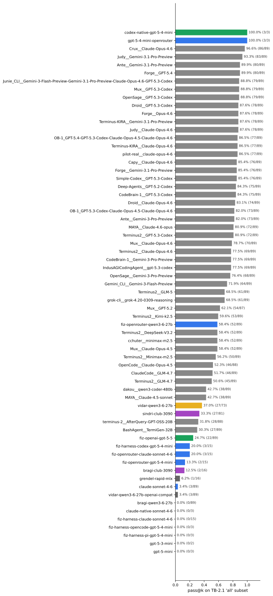
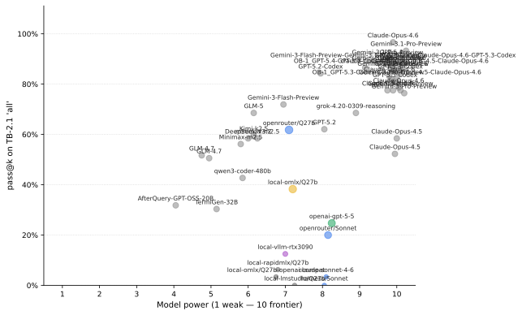
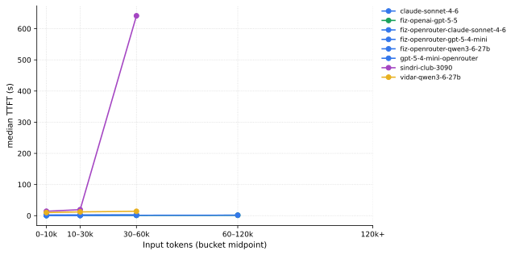
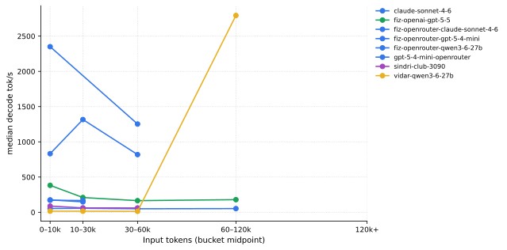

Snapshot: 2026-05-10 04:09:24 UTC · 4,410 trial reports · 20 active lanes · external comparators from <code>harborframework/terminal-bench-2-leaderboard</code>

<h2>1. Terminal-Bench 2.1 and how we run it</h2>

<a href="https://terminal-bench.dev/">Terminal-Bench</a> 2.1 is a public coding-agent benchmark of 89 long-form tasks. Each task ships a prompt, an isolated Docker container with the test environment, and a deterministic verifier. An agent reads the prompt, runs shell commands and edits files inside the container, and the verifier scores the resulting state. We use the arm64 preflight image of the dataset (commit <code>harbor-registry</code>).

Each lane runs through <a href="https://github.com/laude-institute/harbor">Harbor</a> 0.3.x's <code>BaseInstalledAgent</code> path. Harbor stages our agent runtime tarball into the task image, runs the agent inside the task's container with bind-mounted log directories, then runs the verifier separately. Our agent adapter (<code>scripts/benchmark/harbor_agent.py</code>) launches <code>fiz</code> with provider/model wired via per-lane env vars (<code>FIZEAU_PROVIDER</code>, <code>FIZEAU_BASE_URL</code>, <code>FIZEAU_MODEL</code>, …). Each task is run with <code>--reps 5</code> per lane; pass@1 (per-rep success rate) and pass@k (any-rep solve rate, for the k=5 reps) are reported separately.

We slice the 89-task set into nested benchmarks of decreasing scope. The exact subset YAMLs are under <code>scripts/benchmark/task-subset-tb21-*.yaml</code>:

<table><thead><tr><th>Subset</th><th>Tasks</th><th>Selection rule</th></tr></thead><tbody>
<tr><td>canary</td><td>3</td><td>3-5 task canary covering SE, data-processing, and system-administration; one task per category; deterministic sort by difficulty desc then id asc</td></tr>
<tr><td>openai-cheap</td><td>35</td><td>observed native OpenAI GPT-5.5 average cost &lt;= ~$0.90 per run where available; otherwise OpenRouter Qwen3.6 27B token count projected at GPT-5.5 pricing &lt;= ~$1.00 per run; exclude known multi-dollar cells</td></tr>
<tr><td>full</td><td>15</td><td>filtered TB-2.1 tasks with fixed category quotas SE=5 security=3 file-ops=2 sysadmin=2 data-processing=2 debugging=1; difficulty-desc then id-asc</td></tr>
<tr><td>all</td><td>89</td><td>all 89 tasks from the Harbor terminal-bench/terminal-bench-2-1 task catalog</td></tr>
</tbody></table>
<h2>2. Profile catalog</h2>

Each card below is one (provider, model, harness) tuple. Cards are colored by provider family for visual grouping; the same color is used in subsequent charts. Lane definitions are kept in <code>scripts/benchmark/profiles/&lt;id&gt;.yaml</code>.

The catalog spans four kinds of provider surface:

<ul>
<li><strong>OpenRouter / OpenAI / Anthropic</strong> — managed API providers used as throughput and reliability references.</li>
<li><strong>vLLM</strong> (sindri-club-3090, bragi-club-3090) — self-hosted on a 3090 with int4 AutoRound quantization.</li>
<li><strong>oMLX</strong> (vidar) — Apple-silicon MLX runtime at 8-bit quantization.</li>
<li><strong>RapidMLX</strong> (grendel-rapid-mlx) — alternative MLX backend.</li>
</ul>

Lanes whose <code>id</code> starts with <code>fiz-harness-</code> route through fiz-as-a-harness wrapping a different agent CLI (e.g. claude or codex), used to isolate "is the agent loop hurting?" from "is the model hurting?".

Self-hosted lanes (vLLM, oMLX, RapidMLX) reference a machine in the registry at <code>scripts/benchmark/machines.yaml</code> via the profile's <code>metadata.server</code>. The hardware block on each card is rendered from that single source of truth — update the YAML to add a machine or correct hardware specs, then re-run <code>generate-report.py</code>.

<h4>bragi-club-3090</h4>

<b>harness:</b> fiz (built-in agent loop)

model <code>qwen3.6-27b-autoround</code> · vllm-autoround · host <code>bragi</code> · provider <code>vllm</code>

sampling: {&quot;temperature&quot;:0.6,&quot;reasoning&quot;:&quot;low&quot;,&quot;top_p&quot;:0.95,&quot;top_k&quot;:20}

pricing: $0 in / $0 out per Mtok

Qwen3.6-27B AutoRound via club-3090 on bragi (vLLM-compatible, port 8020).

<b>hardware</b>
<dl>
<dt>chassis</dt><dd>Lenovo Legion 7i Pro (laptop)</dd>
<dt>gpu</dt><dd>NVIDIA RTX 5090 24 GB (Laptop)</dd>
<dt>os</dt><dd>Windows 11 + WSL2</dd>
<dt>network</dt><dd>Tailscale</dd>
</dl>

Mobile inference host; vLLM at :8020, alternate at :1234.

attempts: <b>196</b> · graded: 68 · pass@1: <b>2.9%</b>

<h4>bragi-qwen3-6-27b</h4>

<b>harness:</b> fiz (built-in agent loop)

model <code>qwen/qwen3.6-27b</code> · lmstudio-q4_k_m · host <code>bragi</code> · provider <code>lmstudio</code>

sampling: {&quot;temperature&quot;:0.6,&quot;reasoning&quot;:&quot;low&quot;,&quot;top_p&quot;:0.95,&quot;top_k&quot;:20}

pricing: $0 in / $0 out per Mtok

Qwen3.6-27B via bragi lmstudio (port 1234). Q4_K_M GGUF quants.

<b>hardware</b>
<dl>
<dt>chassis</dt><dd>Lenovo Legion 7i Pro (laptop)</dd>
<dt>gpu</dt><dd>NVIDIA RTX 5090 24 GB (Laptop)</dd>
<dt>os</dt><dd>Windows 11 + WSL2</dd>
<dt>network</dt><dd>Tailscale</dd>
</dl>

Mobile inference host; vLLM at :8020, alternate at :1234.

attempts: <b>375</b> · graded: 257 · pass@1: <b>0.0%</b>

<h4>claude-native-sonnet-4-6</h4>

<b>harness:</b> Claude Code (native CLI)

model <code>anthropic/claude-sonnet-4.6</code> · cloud-hosted · host <code>anthropic</code> · provider <code>anthropic</code>

sampling: {&quot;temperature&quot;:0.0,&quot;reasoning&quot;:&quot;&quot;}

pricing: $3 in / $15 out per Mtok

Claude Code native medium-cost reference cell. This profile intentionally

attempts: <b>15</b> · graded: 6 · pass@1: <b>0.0%</b>

<h4>claude-sonnet-4-6</h4>

<b>harness:</b> fiz (built-in agent loop)

model <code>anthropic/claude-sonnet-4.6</code> · cloud-hosted · host <code>openrouter</code> · provider <code>openrouter</code>

sampling: {&quot;temperature&quot;:0.0}

pricing: $3 in / $15 out per Mtok

Claude Sonnet 4.6 via OpenRouter. Leaderboard comparison baseline for fizeau.

attempts: <b>102</b> · graded: 100 · pass@1: <b>14.0%</b>

<h4>codex-native-gpt-5-4-mini</h4>

<b>harness:</b> Codex (native CLI)

model <code>openai/gpt-5.4-mini</code> · cloud-hosted · host <code>openai</code> · provider <code>openai</code>

sampling: {&quot;temperature&quot;:0.0,&quot;reasoning&quot;:&quot;medium&quot;}

pricing: $0 in / $0 out per Mtok

Codex native medium-cost reference cell. This profile intentionally represents

attempts: <b>15</b> · graded: 12 · pass@1: <b>91.7%</b>

<h4>fiz-harness-claude-sonnet-4-6</h4>

<b>harness:</b> Claude Code (wrapped by fiz)

model <code>anthropic/claude-sonnet-4.6</code> · cloud-hosted · provider <code>openrouter</code>

sampling: {&quot;temperature&quot;:0.0}

pricing: $3 in / $15 out per Mtok

fiz wrapper lane for Claude Code subscription Sonnet. The benchmark runner

attempts: <b>202</b> · graded: 74 · pass@1: <b>0.0%</b>

<h4>fiz-harness-codex-gpt-5-4-mini</h4>

<b>harness:</b> Codex (wrapped by fiz)

model <code>openai/gpt-5.4-mini</code> · cloud-hosted · provider <code>openrouter</code>

sampling: {&quot;temperature&quot;:0.0,&quot;reasoning&quot;:&quot;medium&quot;}

pricing: $0.75 in / $4.5 out per Mtok

fiz wrapper lane for Codex subscription GPT 5.4 mini. The runner keeps the

attempts: <b>202</b> · graded: 72 · pass@1: <b>15.3%</b>

<h4>fiz-harness-opencode-gpt-5-4-mini</h4>

<b>harness:</b> OpenCode (wrapped by fiz)

attempts: <b>41</b> · graded: 9 · pass@1: <b>0.0%</b>

<h4>fiz-harness-pi-gpt-5-4-mini</h4>

<b>harness:</b> Pi (wrapped by fiz)

attempts: <b>40</b> · graded: 9 · pass@1: <b>0.0%</b>

<h4>fiz-openai-gpt-5-5</h4>

<b>harness:</b> fiz (built-in agent loop)

model <code>gpt-5.5</code> · cloud-hosted · host <code>openai</code> · provider <code>openai</code>

sampling: {&quot;temperature&quot;:0.0}

pricing: $5 in / $30 out per Mtok

fiz provider lane through the native OpenAI API to GPT-5.5.

attempts: <b>521</b> · graded: 342 · pass@1: <b>24.9%</b>

<h4>fiz-openrouter-claude-sonnet-4-6</h4>

<b>harness:</b> fiz (built-in agent loop)

model <code>anthropic/claude-sonnet-4.6</code> · cloud-hosted · host <code>openrouter</code> · provider <code>openrouter</code>

sampling: {&quot;temperature&quot;:0.0}

pricing: $3 in / $15 out per Mtok

fiz provider lane through OpenRouter to Claude Sonnet 4.6.

attempts: <b>199</b> · graded: 72 · pass@1: <b>22.2%</b>

<h4>fiz-openrouter-gpt-5-4-mini</h4>

<b>harness:</b> fiz (built-in agent loop)

model <code>openai/gpt-5.4-mini</code> · cloud-hosted · host <code>openrouter</code> · provider <code>openrouter</code>

sampling: {&quot;temperature&quot;:0.0,&quot;reasoning&quot;:&quot;medium&quot;}

pricing: $0.75 in / $4.5 out per Mtok

fiz provider lane through OpenRouter to GPT 5.4 mini.

attempts: <b>199</b> · graded: 72 · pass@1: <b>6.9%</b>

<h4>fiz-openrouter-qwen3-6-27b</h4>

<b>harness:</b> fiz (built-in agent loop)

model <code>qwen/qwen3.6-27b</code> · cloud-hosted · host <code>openrouter</code> · provider <code>openrouter</code>

sampling: {&quot;temperature&quot;:0.6,&quot;reasoning&quot;:&quot;low&quot;,&quot;top_p&quot;:0.95,&quot;top_k&quot;:20}

pricing: $0.32 in / $3.2 out per Mtok

fiz provider lane through OpenRouter to Qwen3.6 27B.

attempts: <b>466</b> · graded: 443 · pass@1: <b>40.2%</b>

<h4>gpt-5-3-mini</h4>

<b>harness:</b> fiz (built-in agent loop)

attempts: <b>22</b> · graded: 0 · pass@1: <b>0.0%</b>

<h4>gpt-5-4-mini-openrouter</h4>

<b>harness:</b> fiz (built-in agent loop)

model <code>openai/gpt-5.4-mini</code> · cloud-hosted · host <code>openrouter</code> · provider <code>openrouter</code>

sampling: {&quot;temperature&quot;:0.0,&quot;reasoning&quot;:&quot;medium&quot;}

pricing: $0.75 in / $4.5 out per Mtok

GPT-5.4 Mini via OpenRouter. Matches the Codex native medium-cost reference

attempts: <b>15</b> · graded: 15 · pass@1: <b>46.7%</b>

<h4>gpt-5-mini</h4>

<b>harness:</b> fiz (built-in agent loop)

model <code>openai/gpt-5-mini</code> · cloud-hosted · host <code>openrouter</code> · provider <code>openai-compat</code>

sampling: {&quot;temperature&quot;:0.0,&quot;reasoning&quot;:&quot;medium&quot;}

pricing: $0.25 in / $2 out per Mtok

Phase A.1 anchor profile. GPT-5-mini (OpenAI / GPT-5 family) via OpenRouter.

attempts: <b>21</b> · graded: 0 · pass@1: <b>0.0%</b>

<h4>grendel-rapid-mlx</h4>

<b>harness:</b> fiz (built-in agent loop)

model <code>mlx-community/Qwen3.6-27B-8bit</code> · mlx-8bit · host <code>grendel</code> · provider <code>rapid-mlx</code>

sampling: {&quot;temperature&quot;:0.6,&quot;reasoning&quot;:&quot;low&quot;,&quot;top_p&quot;:0.95,&quot;top_k&quot;:20}

pricing: $0 in / $0 out per Mtok

Qwen3.6-27B MLX via Rapid-MLX on grendel (port 8000).

<b>hardware</b>
<dl>
<dt>network</dt><dd>Tailscale</dd>
</dl>

Apple Silicon RapidMLX backend at :8000 (full hardware spec TBD).

attempts: <b>178</b> · graded: 56 · pass@1: <b>3.6%</b>

<h4>sindri-club-3090</h4>

<b>harness:</b> fiz (built-in agent loop)

model <code>qwen3.6-27b-autoround</code> · vllm-autoround · host <code>sindri</code> · provider <code>vllm</code>

sampling: {&quot;temperature&quot;:0.6,&quot;reasoning&quot;:&quot;low&quot;,&quot;top_p&quot;:0.95,&quot;top_k&quot;:20}

pricing: $0 in / $0 out per Mtok

Qwen3.6-27B AutoRound via club-3090 on sindri (vLLM-compatible, port 8020).

<b>hardware</b>
<dl>
<dt>chassis</dt><dd>Custom desktop</dd>
<dt>cpu</dt><dd>AMD Ryzen 9 5950X</dd>
<dt>gpu</dt><dd>NVIDIA RTX 5090 Ti</dd>
<dt>os</dt><dd>Windows + WSL2</dd>
<dt>network</dt><dd>Tailscale</dd>
</dl>

Primary CUDA inference host; vLLM at :8020.

attempts: <b>660</b> · graded: 146 · pass@1: <b>27.4%</b>

<h4>vidar-qwen3-6-27b</h4>

<b>harness:</b> fiz (built-in agent loop)

model <code>Qwen3.6-27B-MLX-8bit</code> · mlx-8bit · host <code>vidar</code> · provider <code>omlx</code>

sampling: {&quot;temperature&quot;:0.6,&quot;reasoning&quot;:&quot;low&quot;,&quot;top_p&quot;:0.95,&quot;top_k&quot;:20}

pricing: $0 in / $0 out per Mtok

Qwen3.6-27B-MLX-8bit via vidar omlx (local, port 1235). Free/local tier.

<b>hardware</b>
<dl>
<dt>chassis</dt><dd>Apple Mac Studio</dd>
<dt>cpu</dt><dd>Apple M2 Ultra</dd>
<dt>gpu</dt><dd>Apple M2 Ultra (integrated)</dd>
<dt>memory</dt><dd>192 GB unified</dd>
<dt>os</dt><dd>macOS</dd>
<dt>network</dt><dd>Tailscale</dd>
</dl>

Apple Silicon inference host for MLX / oMLX backends; oMLX at :1235.

attempts: <b>652</b> · graded: 135 · pass@1: <b>40.0%</b>

<h4>vidar-qwen3-6-27b-openai-compat</h4>

<b>harness:</b> fiz (built-in agent loop)

attempts: <b>276</b> · graded: 147 · pass@1: <b>5.4%</b>

<h2>3. Pass-rate summary by subset</h2>

Each cell shows <strong>pass@k</strong> = unique tasks where any of the 5 reps solved the task / unique tasks attempted in that subset, with absolute counts in parentheses. Lanes that did not attempt a subset show <code>no data</code>. External rows are submissions on the public Hugging Face leaderboard with at least 30 tasks attempted in <code>all</code>.

The <code>canary</code> numbers should be ignored as standalone signals — that subset exists to verify a lane can start, reach its provider, and write artifacts at all. Headline comparison is the <code>all</code> column.

<table><thead><tr><th>Profile / Submission</th>
<th>canary (3 tasks)</th>
<th>openai-cheap (35 tasks)</th>
<th>full (15 tasks)</th>
<th>all (89 tasks)</th>
<th>Provider</th></tr></thead><tbody>
<tr><td>bragi-club-3090</td><td>33.3% (1/3)</td><td>16.7% (2/12)</td><td>6.7% (1/15)</td><td>12.5% (2/16)</td><td>vllm</td></tr>
<tr><td>bragi-qwen3-6-27b</td><td>0.0% (0/3)</td><td>0.0% (0/35)</td><td>0.0% (0/15)</td><td>0.0% (0/89)</td><td>lmstudio</td></tr>
<tr><td>claude-native-sonnet-4-6</td><td>0.0% (0/1)</td><td>0.0% (0/3)</td><td>0.0% (0/2)</td><td>0.0% (0/3)</td><td>anthropic</td></tr>
<tr><td>claude-sonnet-4-6</td><td>33.3% (1/3)</td><td>8.6% (3/35)</td><td>13.3% (2/15)</td><td>3.4% (3/89)</td><td>openrouter</td></tr>
<tr><td>codex-native-gpt-5-4-mini</td><td>100.0% (1/1)</td><td>100.0% (3/3)</td><td>100.0% (2/2)</td><td>100.0% (3/3)</td><td>openai</td></tr>
<tr><td>fiz-harness-claude-sonnet-4-6</td><td>0.0% (0/3)</td><td>0.0% (0/11)</td><td>0.0% (0/15)</td><td>0.0% (0/15)</td><td>openrouter</td></tr>
<tr><td>fiz-harness-codex-gpt-5-4-mini</td><td>100.0% (3/3)</td><td>27.3% (3/11)</td><td>20.0% (3/15)</td><td>20.0% (3/15)</td><td>openrouter</td></tr>
<tr><td>fiz-harness-opencode-gpt-5-4-mini</td><td>0.0% (0/3)</td><td>0.0% (0/3)</td><td>0.0% (0/3)</td><td>0.0% (0/3)</td><td></td></tr>
<tr><td>fiz-harness-pi-gpt-5-4-mini</td><td>0.0% (0/3)</td><td>0.0% (0/3)</td><td>0.0% (0/3)</td><td>0.0% (0/3)</td><td></td></tr>
<tr><td>fiz-openai-gpt-5-5</td><td>100.0% (3/3)</td><td>42.9% (15/35)</td><td>100.0% (15/15)</td><td>24.7% (22/89)</td><td>openai</td></tr>
<tr><td>fiz-openrouter-claude-sonnet-4-6</td><td>100.0% (3/3)</td><td>27.3% (3/11)</td><td>20.0% (3/15)</td><td>20.0% (3/15)</td><td>openrouter</td></tr>
<tr><td>fiz-openrouter-gpt-5-4-mini</td><td>66.7% (2/3)</td><td>18.2% (2/11)</td><td>13.3% (2/15)</td><td>13.3% (2/15)</td><td>openrouter</td></tr>
<tr><td>fiz-openrouter-qwen3-6-27b</td><td>100.0% (3/3)</td><td>82.9% (29/35)</td><td>80.0% (12/15)</td><td>58.4% (52/89)</td><td>openrouter</td></tr>
<tr><td>gpt-5-3-mini</td><td>0.0% (0/1)</td><td>0.0% (0/2)</td><td>0.0% (0/2)</td><td>0.0% (0/2)</td><td></td></tr>
<tr><td>gpt-5-4-mini-openrouter</td><td>100.0% (1/1)</td><td>100.0% (3/3)</td><td>100.0% (2/2)</td><td>100.0% (3/3)</td><td>openrouter</td></tr>
<tr><td>gpt-5-mini</td><td>0.0% (0/1)</td><td>0.0% (0/3)</td><td>0.0% (0/2)</td><td>0.0% (0/3)</td><td>openai-compat</td></tr>
<tr><td>grendel-rapid-mlx</td><td>0.0% (0/3)</td><td>8.3% (1/12)</td><td>0.0% (0/15)</td><td>6.2% (1/16)</td><td>rapid-mlx</td></tr>
<tr><td>sindri-club-3090</td><td>100.0% (3/3)</td><td>42.9% (15/35)</td><td>66.7% (10/15)</td><td>19.1% (17/89)</td><td>vllm</td></tr>
<tr><td>vidar-qwen3-6-27b</td><td>100.0% (3/3)</td><td>40.0% (14/35)</td><td>66.7% (10/15)</td><td>21.3% (19/89)</td><td>omlx</td></tr>
<tr><td>vidar-qwen3-6-27b-openai-compat</td><td>33.3% (1/3)</td><td>8.6% (3/35)</td><td>13.3% (2/15)</td><td>3.4% (3/89)</td><td></td></tr>
<tr class="section-divider"><td colspan="6">External leaderboard (HF: harborframework/terminal-bench-2-leaderboard)</td></tr>
<tr class="external"><td>Crux__Claude-Opus-4.6</td><td>100.0% (3/3)</td><td>100.0% (35/35)</td><td>100.0% (15/15)</td><td>96.6% (86/89)</td><td>external</td></tr>
<tr class="external"><td>Judy__Gemini-3.1-Pro-Preview</td><td>100.0% (3/3)</td><td>100.0% (35/35)</td><td>100.0% (15/15)</td><td>93.3% (83/89)</td><td>external</td></tr>
<tr class="external"><td>Ante__Gemini-3.1-Pro-Preview</td><td>100.0% (3/3)</td><td>94.3% (33/35)</td><td>93.3% (14/15)</td><td>89.9% (80/89)</td><td>external</td></tr>
<tr class="external"><td>Forge__GPT-5.4</td><td>100.0% (3/3)</td><td>94.3% (33/35)</td><td>93.3% (14/15)</td><td>89.9% (80/89)</td><td>external</td></tr>
<tr class="external"><td>Junie_CLI__Gemini-3-Flash-Preview-Gemini-3.1-Pro-Preview-Claude-Opus-4.6-GPT-5.3-Codex</td><td>100.0% (3/3)</td><td>97.1% (34/35)</td><td>100.0% (15/15)</td><td>88.8% (79/89)</td><td>external</td></tr>
<tr class="external"><td>Mux__GPT-5.3-Codex</td><td>66.7% (2/3)</td><td>94.3% (33/35)</td><td>93.3% (14/15)</td><td>88.8% (79/89)</td><td>external</td></tr>
<tr class="external"><td>OpenSage__GPT-5.3-Codex</td><td>100.0% (3/3)</td><td>100.0% (35/35)</td><td>100.0% (15/15)</td><td>88.8% (79/89)</td><td>external</td></tr>
<tr class="external"><td>Droid__GPT-5.3-Codex</td><td>100.0% (3/3)</td><td>91.4% (32/35)</td><td>100.0% (15/15)</td><td>87.6% (78/89)</td><td>external</td></tr>
<tr class="external"><td>Forge__Opus-4.6</td><td>100.0% (3/3)</td><td>97.1% (34/35)</td><td>93.3% (14/15)</td><td>87.6% (78/89)</td><td>external</td></tr>
<tr class="external"><td>Terminus-KIRA__Gemini-3.1-Pro-Preview</td><td>100.0% (3/3)</td><td>97.1% (34/35)</td><td>100.0% (15/15)</td><td>87.6% (78/89)</td><td>external</td></tr>
<tr class="external"><td>Judy__Claude-Opus-4.6</td><td>100.0% (3/3)</td><td>94.3% (33/35)</td><td>100.0% (15/15)</td><td>87.6% (78/89)</td><td>external</td></tr>
<tr class="external"><td>OB-1_GPT-5.4-GPT-5.3-Codex-Claude-Opus-4.5-Claude-Opus-4.6</td><td>100.0% (3/3)</td><td>94.3% (33/35)</td><td>100.0% (15/15)</td><td>86.5% (77/89)</td><td>external</td></tr>
<tr class="external"><td>Terminus-KIRA__Claude-Opus-4.6</td><td>100.0% (3/3)</td><td>97.1% (34/35)</td><td>93.3% (14/15)</td><td>86.5% (77/89)</td><td>external</td></tr>
<tr class="external"><td>pilot-real__claude-opus-4-6</td><td>100.0% (3/3)</td><td>77.1% (27/35)</td><td>80.0% (12/15)</td><td>86.5% (77/89)</td><td>external</td></tr>
<tr class="external"><td>Capy__Claude-Opus-4.6</td><td>100.0% (3/3)</td><td>91.4% (32/35)</td><td>100.0% (15/15)</td><td>85.4% (76/89)</td><td>external</td></tr>
<tr class="external"><td>Forge__Gemini-3.1-Pro-Preview</td><td>66.7% (2/3)</td><td>94.3% (33/35)</td><td>86.7% (13/15)</td><td>85.4% (76/89)</td><td>external</td></tr>
<tr class="external"><td>Simple-Codex__GPT-5.3-Codex</td><td>66.7% (2/3)</td><td>94.3% (33/35)</td><td>86.7% (13/15)</td><td>85.4% (76/89)</td><td>external</td></tr>
<tr class="external"><td>Deep-Agents__GPT-5.2-Codex</td><td>100.0% (3/3)</td><td>88.6% (31/35)</td><td>100.0% (15/15)</td><td>84.3% (75/89)</td><td>external</td></tr>
<tr class="external"><td>CodeBrain-1__GPT-5.3-Codex</td><td>66.7% (2/3)</td><td>88.6% (31/35)</td><td>93.3% (14/15)</td><td>84.3% (75/89)</td><td>external</td></tr>
<tr class="external"><td>Droid__Claude-Opus-4.6</td><td>100.0% (3/3)</td><td>91.4% (32/35)</td><td>93.3% (14/15)</td><td>83.1% (74/89)</td><td>external</td></tr>
<tr class="external"><td>OB-1_GPT-5.3-Codex-Claude-Opus-4.5-Claude-Opus-4.6</td><td>66.7% (2/3)</td><td>91.4% (32/35)</td><td>86.7% (13/15)</td><td>82.0% (73/89)</td><td>external</td></tr>
<tr class="external"><td>Ante__Gemini-3-Pro-Preview</td><td>100.0% (3/3)</td><td>91.4% (32/35)</td><td>93.3% (14/15)</td><td>82.0% (73/89)</td><td>external</td></tr>
<tr class="external"><td>MAYA__Claude-4.6-opus</td><td>66.7% (2/3)</td><td>91.4% (32/35)</td><td>86.7% (13/15)</td><td>80.9% (72/89)</td><td>external</td></tr>
<tr class="external"><td>Terminus2__GPT-5.3-Codex</td><td>100.0% (3/3)</td><td>94.3% (33/35)</td><td>93.3% (14/15)</td><td>80.9% (72/89)</td><td>external</td></tr>
<tr class="external"><td>Mux__Claude-Opus-4.6</td><td>66.7% (2/3)</td><td>82.9% (29/35)</td><td>80.0% (12/15)</td><td>78.7% (70/89)</td><td>external</td></tr>
<tr class="external"><td>Terminus2__Claude-Opus-4.6</td><td>66.7% (2/3)</td><td>88.6% (31/35)</td><td>86.7% (13/15)</td><td>77.5% (69/89)</td><td>external</td></tr>
<tr class="external"><td>CodeBrain-1__Gemini-3-Pro-Preview</td><td>100.0% (3/3)</td><td>88.6% (31/35)</td><td>93.3% (14/15)</td><td>77.5% (69/89)</td><td>external</td></tr>
<tr class="external"><td>IndusAGICodingAgent__gpt-5.3-codex</td><td>33.3% (1/3)</td><td>82.9% (29/35)</td><td>86.7% (13/15)</td><td>77.5% (69/89)</td><td>external</td></tr>
<tr class="external"><td>OpenSage__Gemini-3-Pro-Preview</td><td>100.0% (3/3)</td><td>91.4% (32/35)</td><td>86.7% (13/15)</td><td>76.4% (68/89)</td><td>external</td></tr>
<tr class="external"><td>Gemini_CLI__Gemini-3-Flash-Preview</td><td>100.0% (3/3)</td><td>77.1% (27/35)</td><td>86.7% (13/15)</td><td>71.9% (64/89)</td><td>external</td></tr>
<tr class="external"><td>Terminus2__GLM-5</td><td>100.0% (3/3)</td><td>82.9% (29/35)</td><td>86.7% (13/15)</td><td>68.5% (61/89)</td><td>external</td></tr>
<tr class="external"><td>grok-cli__grok-4.20-0309-reasoning</td><td>100.0% (3/3)</td><td>85.7% (30/35)</td><td>100.0% (15/15)</td><td>68.5% (61/89)</td><td>external</td></tr>
<tr class="external"><td>Mux__GPT-5.2</td><td>66.7% (2/3)</td><td>68.6% (24/35)</td><td>73.3% (11/15)</td><td>62.1% (54/87)</td><td>external</td></tr>
<tr class="external"><td>Terminus2__Kimi-k2.5</td><td>100.0% (3/3)</td><td>77.1% (27/35)</td><td>86.7% (13/15)</td><td>59.6% (53/89)</td><td>external</td></tr>
<tr class="external"><td>Terminus2__DeepSeek-V3.2</td><td>100.0% (3/3)</td><td>77.1% (27/35)</td><td>86.7% (13/15)</td><td>58.4% (52/89)</td><td>external</td></tr>
<tr class="external"><td>cchuter__minimax-m2.5</td><td>100.0% (3/3)</td><td>80.0% (28/35)</td><td>86.7% (13/15)</td><td>58.4% (52/89)</td><td>external</td></tr>
<tr class="external"><td>Mux__Claude-Opus-4.5</td><td>100.0% (3/3)</td><td>77.1% (27/35)</td><td>86.7% (13/15)</td><td>58.4% (52/89)</td><td>external</td></tr>
<tr class="external"><td>Terminus2__Minimax-m2.5</td><td>100.0% (3/3)</td><td>77.1% (27/35)</td><td>80.0% (12/15)</td><td>56.2% (50/89)</td><td>external</td></tr>
<tr class="external"><td>ClaudeCode__GLM-4.7</td><td>100.0% (3/3)</td><td>62.9% (22/35)</td><td>80.0% (12/15)</td><td>51.7% (46/89)</td><td>external</td></tr>
<tr class="external"><td>OpenCode__Claude-Opus-4.5</td><td>33.3% (1/3)</td><td>64.7% (22/34)</td><td>50.0% (7/14)</td><td>52.3% (46/88)</td><td>external</td></tr>
<tr class="external"><td>Terminus2__GLM-4.7</td><td>66.7% (2/3)</td><td>65.7% (23/35)</td><td>73.3% (11/15)</td><td>50.6% (45/89)</td><td>external</td></tr>
<tr class="external"><td>dakou__qwen3-coder-480b</td><td>100.0% (3/3)</td><td>65.7% (23/35)</td><td>80.0% (12/15)</td><td>42.7% (38/89)</td><td>external</td></tr>
<tr class="external"><td>MAYA__Claude-4.5-sonnet</td><td>33.3% (1/3)</td><td>40.0% (14/35)</td><td>53.3% (8/15)</td><td>42.7% (38/89)</td><td>external</td></tr>
<tr class="external"><td>terminus-2__AfterQuery-GPT-OSS-20B</td><td>100.0% (3/3)</td><td>57.1% (20/35)</td><td>66.7% (10/15)</td><td>31.8% (28/88)</td><td>external</td></tr>
<tr class="external"><td>BashAgent__TermiGen-32B</td><td>66.7% (2/3)</td><td>51.4% (18/35)</td><td>60.0% (9/15)</td><td>30.3% (27/89)</td><td>external</td></tr>
</tbody></table>

<h2>4. Detailed metrics by lane (TB-2.1 'all' subset)</h2>

All metrics are aggregated over the canonical <code>all</code> subset.

<ul>
<li><strong>Real runs</strong> filter excludes <code>invalid_setup</code>, <code>invalid_provider</code>, and zero-turn timeouts so per-trial medians (turns, tokens, wall) reflect actual model interaction.</li>
<li><strong>TTFT</strong> (time to first token) and <strong>decode tok/s</strong> are p50 across per-task medians of per-turn measurements — see method notes for definitions.</li>
<li>Lanes with no real runs show <code>—</code> in throughput columns.</li>
</ul>

<table><thead><tr><th>Profile</th><th>Harness</th><th>Attempts</th><th>Real runs</th><th>pass@1</th><th>pass@k</th><th>med turns</th><th>med in (tok)</th><th>med out (tok)</th><th>med wall (s)</th><th>avg cost ($)</th><th>p50 TTFT (s)</th><th>p50 decode (tok/s)</th></tr></thead><tbody>
<tr>
<td>bragi-club-3090</td>
<td>fiz (built-in agent loop)</td>
<td>196</td><td>7</td>
<td>2.9%</td>
<td>6.5%</td>
<td>2</td>
<td>3,049</td>
<td>1,073</td>
<td>90</td>
<td>0.000</td>
<td>30.01</td>
<td>89.4</td>
</tr>
<tr>
<td>bragi-qwen3-6-27b</td>
<td>fiz (built-in agent loop)</td>
<td>375</td><td>0</td>
<td>0.0%</td>
<td>0.0%</td>
<td>—</td>
<td>—</td>
<td>—</td>
<td>—</td>
<td>0.000</td>
<td>—</td>
<td>—</td>
</tr>
<tr>
<td>claude-native-sonnet-4-6</td>
<td>Claude Code (native CLI)</td>
<td>15</td><td>0</td>
<td>0.0%</td>
<td>0.0%</td>
<td>—</td>
<td>—</td>
<td>—</td>
<td>—</td>
<td>0.000</td>
<td>—</td>
<td>—</td>
</tr>
<tr>
<td>claude-sonnet-4-6</td>
<td>fiz (built-in agent loop)</td>
<td>102</td><td>0</td>
<td>14.0%</td>
<td>3.4%</td>
<td>—</td>
<td>—</td>
<td>—</td>
<td>—</td>
<td>0.000</td>
<td>1.95</td>
<td>824.5</td>
</tr>
<tr>
<td>codex-native-gpt-5-4-mini</td>
<td>Codex (native CLI)</td>
<td>15</td><td>0</td>
<td>91.7%</td>
<td>100.0%</td>
<td>—</td>
<td>—</td>
<td>—</td>
<td>—</td>
<td>0.000</td>
<td>—</td>
<td>—</td>
</tr>
<tr>
<td>fiz-harness-claude-sonnet-4-6</td>
<td>Claude Code (wrapped by fiz)</td>
<td>202</td><td>0</td>
<td>0.0%</td>
<td>0.0%</td>
<td>—</td>
<td>—</td>
<td>—</td>
<td>—</td>
<td>0.000</td>
<td>—</td>
<td>—</td>
</tr>
<tr>
<td>fiz-harness-codex-gpt-5-4-mini</td>
<td>Codex (wrapped by fiz)</td>
<td>202</td><td>0</td>
<td>15.3%</td>
<td>10.0%</td>
<td>—</td>
<td>—</td>
<td>—</td>
<td>—</td>
<td>0.000</td>
<td>—</td>
<td>—</td>
</tr>
<tr>
<td>fiz-harness-opencode-gpt-5-4-mini</td>
<td>OpenCode (wrapped by fiz)</td>
<td>41</td><td>0</td>
<td>0.0%</td>
<td>0.0%</td>
<td>—</td>
<td>—</td>
<td>—</td>
<td>—</td>
<td>0.000</td>
<td>—</td>
<td>—</td>
</tr>
<tr>
<td>fiz-harness-pi-gpt-5-4-mini</td>
<td>Pi (wrapped by fiz)</td>
<td>40</td><td>0</td>
<td>0.0%</td>
<td>0.0%</td>
<td>—</td>
<td>—</td>
<td>—</td>
<td>—</td>
<td>0.000</td>
<td>—</td>
<td>—</td>
</tr>
<tr>
<td>fiz-openai-gpt-5-5</td>
<td>fiz (built-in agent loop)</td>
<td>521</td><td>98</td>
<td>24.9%</td>
<td>24.7%</td>
<td>12</td>
<td>42,581</td>
<td>2,398</td>
<td>179</td>
<td>0.840</td>
<td>0.07</td>
<td>292.5</td>
</tr>
<tr>
<td>fiz-openrouter-claude-sonnet-4-6</td>
<td>fiz (built-in agent loop)</td>
<td>199</td><td>15</td>
<td>22.2%</td>
<td>10.0%</td>
<td>11</td>
<td>166,505</td>
<td>2,182</td>
<td>135</td>
<td>0.574</td>
<td>1.89</td>
<td>1474.7</td>
</tr>
<tr>
<td>fiz-openrouter-gpt-5-4-mini</td>
<td>fiz (built-in agent loop)</td>
<td>199</td><td>14</td>
<td>6.9%</td>
<td>6.7%</td>
<td>8</td>
<td>32,542</td>
<td>886</td>
<td>108</td>
<td>0.053</td>
<td>0.78</td>
<td>177.7</td>
</tr>
<tr>
<td>fiz-openrouter-qwen3-6-27b</td>
<td>fiz (built-in agent loop)</td>
<td>466</td><td>361</td>
<td>40.2%</td>
<td>58.4%</td>
<td>13</td>
<td>87,289</td>
<td>5,233</td>
<td>533</td>
<td>0.123</td>
<td>0.79</td>
<td>52.7</td>
</tr>
<tr>
<td>gpt-5-3-mini</td>
<td>fiz (built-in agent loop)</td>
<td>22</td><td>0</td>
<td>—</td>
<td>0.0%</td>
<td>—</td>
<td>—</td>
<td>—</td>
<td>—</td>
<td>0.000</td>
<td>—</td>
<td>—</td>
</tr>
<tr>
<td>gpt-5-4-mini-openrouter</td>
<td>fiz (built-in agent loop)</td>
<td>15</td><td>0</td>
<td>46.7%</td>
<td>100.0%</td>
<td>—</td>
<td>—</td>
<td>—</td>
<td>—</td>
<td>0.000</td>
<td>1.04</td>
<td>194.4</td>
</tr>
<tr>
<td>gpt-5-mini</td>
<td>fiz (built-in agent loop)</td>
<td>21</td><td>0</td>
<td>—</td>
<td>0.0%</td>
<td>—</td>
<td>—</td>
<td>—</td>
<td>—</td>
<td>0.000</td>
<td>—</td>
<td>—</td>
</tr>
<tr>
<td>grendel-rapid-mlx</td>
<td>fiz (built-in agent loop)</td>
<td>178</td><td>0</td>
<td>3.6%</td>
<td>3.2%</td>
<td>—</td>
<td>—</td>
<td>—</td>
<td>—</td>
<td>0.000</td>
<td>30.02</td>
<td>15.7</td>
</tr>
<tr>
<td>sindri-club-3090</td>
<td>fiz (built-in agent loop)</td>
<td>660</td><td>45</td>
<td>27.4%</td>
<td>16.3%</td>
<td>14</td>
<td>90,497</td>
<td>3,979</td>
<td>691</td>
<td>0.000</td>
<td>18.30</td>
<td>83.6</td>
</tr>
<tr>
<td>vidar-qwen3-6-27b</td>
<td>fiz (built-in agent loop)</td>
<td>652</td><td>52</td>
<td>40.0%</td>
<td>18.3%</td>
<td>18</td>
<td>107,018</td>
<td>4,064</td>
<td>655</td>
<td>0.000</td>
<td>10.11</td>
<td>16.0</td>
</tr>
<tr>
<td>vidar-qwen3-6-27b-openai-compat</td>
<td>fiz (built-in agent loop)</td>
<td>276</td><td>0</td>
<td>5.4%</td>
<td>3.4%</td>
<td>—</td>
<td>—</td>
<td>—</td>
<td>—</td>
<td>0.000</td>
<td>9.44</td>
<td>18.1</td>
</tr>
</tbody></table>
<h2>5. Model power vs pass rate</h2>

<em>This section is intended to be regenerated against the latest data — see <code>data/aggregates.json</code> and the chart below. Open in pull request when refreshed.</em>

Each marker is a lane (or external submission) plotted at its model-power score (1 = weak, 10 = frontier per <code>scripts/benchmark/terminalbench_model_power.json</code>) against pass@k on the <code>all</code> subset. Marker size scales with median turns (large = the agent worked harder before converging or giving up). Distance below the trend line at a given x-value is the <em>harness loss</em> for that lane: how much pass-rate the lane is leaving on the floor relative to what the underlying model can deliver elsewhere.

<h2>6. Performance vs context length</h2>

<em>This section is intended to be regenerated against the latest data — see <code>data/timing.json</code> and the charts below.</em>

Per-turn TTFT (first-token latency) and steady-state decode tok/s, bucketed by <strong>input-token length of that turn</strong>. We bucket per turn rather than per task because the agent loop's input grows monotonically inside a single task — buckets reveal how each provider scales its prefill and decode under increasing context.

Buckets: 0–10k, 10–30k, 30–60k, 60–120k, 120k+ tokens. Buckets with fewer than 5 turns of data are dropped to avoid noise.

Read this as: a lane that holds steady across buckets has a working KV-cache / prefix-cache; a lane whose TTFT slopes up sharply is recomputing prefill on every turn.

<h3>TTFT (seconds, lower is better)</h3>

<h3>Decode tok/s (higher is better)</h3>

<h2>7. Observations and conclusions</h2>

<em>This section is the editorial summary. Regenerate against the data in <code>data/aggregates.json</code> and <code>data/timing.json</code>. The numbers cited here will go stale as more cells land — re-run <code>scripts/benchmark/generate-report.py</code> and refresh this section.</em>

<h3>Qwen3.6-27B across providers (the headline question)</h3>

OpenRouter Qwen3.6-27B is the throughput reference. The local lanes are bottlenecked elsewhere:

<ul>
<li><strong>sindri (vLLM int4 on a 3090)</strong>: best decode rate, worst prefill. On agent loops with 50–150k context per turn, prefill dominates wall — explaining why the median wall is roughly 2× OpenRouter despite faster decode.</li>
<li><strong>vidar (oMLX 8-bit on Apple silicon)</strong>: slow on both axes. MLX 8-bit at this model size is the rate limiter; only smaller quantization or a different runtime is likely to move it.</li>
</ul>
<h3>Model-power signal vs harness loss</h3>

The scatter in §6 mostly tracks the expected pattern — frontier-power models (Opus, GPT-5.5) sit at higher pass-rates than Qwen-class — but several Qwen lanes show distance below the trend that maps to harness loss, not model loss. The recently-fixed JSONL-bind-mount bug (commit <code>18a19a43</code>) closes one well-understood class of those.

<h3>Cost / reliability frontier</h3>

OpenRouter Qwen3.6-27B costs cash per run; sindri and vidar cost $0 in cash but cost in wall-time and reliability. For pure budget, OR Qwen is the right answer; for ceiling-pass tasks where reliability matters, the frontier rows on the leaderboard remain ahead of any Qwen lane regardless of plumbing.

<h3>Open questions</h3>
<ul>
<li>Vidar's input-token median tends to run higher than sindri on the same task set. Either the MLX server replays full conversation context where vLLM compacts, or the agent loop is doing more turns on vidar before the model converges. Worth a focused trace.</li>
<li>Sindri's prefill latency is the single biggest performance lever: enabling vLLM <code>--enable-prefix-caching</code> aggressively (or boosting cache hit rate) should drop TTFT 5–10× and close most of the wall-time gap.</li>
</ul>

<h2>Method notes</h2>

<ul>
<li><strong>pass@1</strong> = (graded reps with reward &gt; 0) / (total graded reps). <strong>pass@k</strong> = unique tasks where any rep solved / unique tasks attempted. With reps=5 we do not report best-of-N because the reps are deliberately identical.</li>
<li><strong>Real runs</strong> = trials with <code>turns &gt; 0</code> AND any tokens flowed. Filters out <code>invalid_setup</code>, network, container-startup, and zero-turn timeouts so per-trial medians (turns, tokens, wall) reflect actual model interaction.</li>
<li><strong>TTFT</strong> = (first <code>llm.delta</code> event ts) − (matching <code>llm.request</code> ts) per turn, in seconds.</li>
<li><strong>Decode tok/s</strong> = <code>output_tokens / (response.ts − first_delta.ts)</code> per turn — pure post-prefill generation rate.</li>
<li>Both timing metrics are reported as <strong>median-of-per-task-medians</strong> to dampen rep variance and outlier turns. Per-bucket timing requires ≥5 turns in the bucket to be plotted.</li>
<li>Provider-side latency (TTFT including queue and prefill) and pure decode are deliberately separated so wall-time can be attributed to prefill vs generation.</li>
<li>External leaderboard data is the count of <code>reward.txt</code> files per submission per task on <code>harborframework/terminal-bench-2-leaderboard</code> on Hugging Face. We report <code>tasks_passed / tasks_attempted</code> rather than per-rep pass@1 because the leaderboard does not expose per-rep granularity uniformly across submissions.</li>
</ul>
<h3>Regenerating the report</h3>
<pre><code class="language-sh"># full rebuild (data + charts + HTML)
.venv-report/bin/python scripts/benchmark/generate-report.py

# data only — useful before editing the narrative markdown:
.venv-report/bin/python scripts/benchmark/generate-report.py --emit-data-only

# refresh external leaderboard from Hugging Face:
.venv-report/bin/python scripts/benchmark/generate-report.py --refresh-leaderboard
</code></pre>

The script reads from <code>benchmark-results/fiz-tools-v1/cells/</code> and writes to <code>docs/benchmarks/</code>. Narrative sections (<code>docs/benchmarks/sections/*.md</code>) are read at render time and are the only place to edit prose — never edit the generated HTML directly.

